<p align="center">
  
</p>

<p align="center">
  <strong>Backend as a Service. One binary. MIT licensed.</strong>
</p>

<p align="center">
  <a href="https://github.com/sinopebase/sinopebase/actions/workflows/ci.yml"></a>
  <a href="https://github.com/sinopebase/sinopebase/actions/workflows/supply-chain.yml"></a>
  <a href="LICENSE"></a>
  <a href="https://bun.sh"></a>
</p>

<br/>

<p align="center">
  <a href="https://railway.com/deploy/dCZjHz?referralCode=9TQA5W">
    
  </a>
</p>

<p align="center">
  <sub><strong>Want it now?</strong> Deploy to Railway in 30 seconds. Free tier. No credit card.</sub>
</p>

---

## What is Sinopebase?

Sinopebase is a **Backend as a Service built on Elysia** — good performance, core dev features, easily extensible via plugins, MIT licensed. It replaces six microservices (Kong, GoTrue, PostgREST, Realtime, Storage, Admin API) with one process. **Swap one import, change the URL** — everything else in your supabase-js code stays the same.

It's for builders who want to focus on their product, not rebuild auth and data layers from scratch for the 10th time. One binary that gives you database, auth, storage, realtime, edge functions, and AI — all speaking the supabase-js API you already know.

> **What you bring:** PostgreSQL (anywhere — Railway, AWS, Hetzner, your laptop) and S3-compatible storage (MinIO, R2, S3). Sinopebase handles everything else.

```ts
// One import swap. That's it.
import { createClient } from 'sinopebase'
// was: import { createClient } from '@supabase/supabase-js'

const sb = createClient('https://my-sinopebase.railway.app', 'anon-key')

const { data } = await sb.from('todos').select('*')
const { data: { user } } = await sb.auth.signInWithPassword({ email, password })
```

---

## Why Sinopebase?

| | Supabase Self-Hosted | Sinopebase |
|---|:---:|---|
| **License** | MIT | MIT |
| **Deploy** | 6+ containers (Kong, GoTrue, PostgREST, Realtime, Storage, Admin API) | **Single Bun service + PostgreSQL + S3** |
| **Database** | PostgreSQL | PostgreSQL |
| **SDK** | supabase-js | **supabase-js (one import swap)** |
| **Auth** | GoTrue (Go) | **better-auth (TypeScript)** |
| **Edge Functions** | Deno Deploy | **Bun Worker sandbox** |
| **AI / Agents** | — | **Mastra agents + MCP tools** |
| **Realtime** | Phoenix Channels | **Phoenix Channels + PG LISTEN/NOTIFY** |
| **Admin UI** | Supabase Studio | **Svelte 5 — editorial dark** |
| **Storage** | S3 | **S3 / MinIO / RustFS** |
| **TLS** | Self-managed | **Bun-native + LetsEncrypt** |
| **OAuth** | 12+ built-in providers | **Built-in social + generic OIDC (Keycloak, Okta, Auth0, Entra ID)** |
| **Presence** | Phoenix Presence | **Phoenix Presence (track/untrack, diff, heartbeat sweeper)** |
| **Extensibility** | — | **Plugin system — hooks, custom endpoints, background jobs** |
| **Payments** | — | **better-auth payment flows (planned)** |

**The bottom line:** If you want PostgreSQL, Phoenix Channels, and supabase-js compatibility — but don't want to orchestrate six containers — Sinopebase is one service that does all of it. You focus on your product, not the infrastructure.

---

## 🚀 Quick Start

```bash
git clone https://github.com/sinopebase/sinopebase
cd sinopebase

# Copy .env.example and fill in your keys
cp .env.example .env

# Start PostgreSQL + RustFS + Sinopebase
docker compose up -d

# Or run without Docker:
bun install && bun run dev    # → http://localhost:8090
```

Admin UI at [`http://localhost:8090/_/`](http://localhost:8090/_/). SDK ready at `http://localhost:8090/rest/v1/`.

> **AI features** (playground, agents, chat) need an `OPENAI_API_KEY`. Without one, the mock provider echoes back your messages — fine for dev, not for production.

---

## ☁️ Deploy on Railway

<p align="center">
  <a href="https://railway.com/deploy/dCZjHz?referralCode=9TQA5W">
    
  </a>
</p>

Railway auto-detects the `railway.toml`, builds the Dockerfile, provisions PostgreSQL, and gives you a public URL. TLS is terminated at Railway's edge.

**After deploying, set these secrets in the Railway dashboard:**

```bash
JWT_SECRET=$(openssl rand -hex 32)
SINOPEBASE_SERVICE_ROLE_KEY=$(openssl rand -hex 32)
SINOPEBASE_ANON_KEY=$(openssl rand -hex 32)

# Optional — for AI features:
OPENAI_API_KEY=sk-...
```

See [`.env.railway`](.env.railway) for the full variable reference.

### Docker (production)

```bash
# Pull the latest image and run with PostgreSQL + S3
docker compose -f docker-compose.prod.yml up -d
```

Or run the image directly:

```bash
docker run -p 8090:8090 \
  -e POSTGRES_URL=postgres://... \
  -e S3_ENDPOINT=https://... \
  -e JWT_SECRET=$(openssl rand -hex 32) \
  -e SINOPEBASE_SERVICE_ROLE_KEY=$(openssl rand -hex 32) \
  -e SINOPEBASE_ANON_KEY=$(openssl rand -hex 32) \
  -e SINOPEBASE_PRODUCTION=true \
  ghcr.io/kalvexdotdev/sinopebase:latest
```

Pin to a specific version for production: `ghcr.io/kalvexdotdev/sinopebase:v0.6.2`

### Bare Metal

```bash
bun run compile                            # single binary at ./sinopebase
./sinopebase --port 8090 --postgresUrl postgres://...
```

---

## 💻 SDK

Sinopebase implements the supabase-js API surface. Swap `@supabase/supabase-js` for `sinopebase`, change the URL — everything else stays the same.

```ts
import { createClient } from 'sinopebase'

const sb = createClient('https://your-instance.example.com', 'your-anon-key')

// Database
const { data } = await sb.from('todos').select('*').eq('done', false).order('created_at')
const { data } = await sb.from('todos').insert({ title: 'Ship it' })

// Auth
const { data: { user } } = await sb.auth.signUp({ email, password })
const { data: { session } } = await sb.auth.signInWithPassword({ email, password })

// Storage
const { data } = await sb.storage.from('avatars').upload('photo.png', file)
const url = sb.storage.from('avatars').getPublicUrl('photo.png')

// Realtime (Phoenix Channels — same as Supabase)
const channel = sb.channel('room-1')
channel.on('broadcast', { event: 'message' }, (payload) => console.log(payload))
channel.subscribe()

// Edge Functions
const { data } = await sb.functions.invoke('hello', { body: { name: 'World' } })

// AI
const { data } = await sb.functions.invoke('chat', {
  body: { messages: [{ role: 'user', content: 'Summarize my todos' }] }
})
```

---

## 🎨 Admin UI

Complete admin dashboard at `/_/` — editorial dark, Cormorant Garamond + Inter, single mint accent.

| | | |
|:---:|:---:|:---:|
| **Table Editor** — browse, filter, sort, edit, import/export CSV | **Auth Users** — create, delete, reset passwords, view sessions | **Storage** — bucket browser, file upload/download |
| **RLS Policies** — per-table policy viewer and editor | **API Docs** — auto-generated curl + JS examples | **Realtime Inspector** — live WebSocket message monitor |
| **Backups** — create, restore, schedule | **Metrics** — request rate, latency, errors, DB pool | **AI Playground** — chat with Mastra agents |
| **Logs** — server-side request log viewer with filtering | **Cron Jobs** — scheduled task manager | **Settings** — instance configuration |

<details>
<summary><strong>📸 Screenshot Gallery</strong></summary>
<br/>

| | | |
|:---:|:---:|:---:|
| 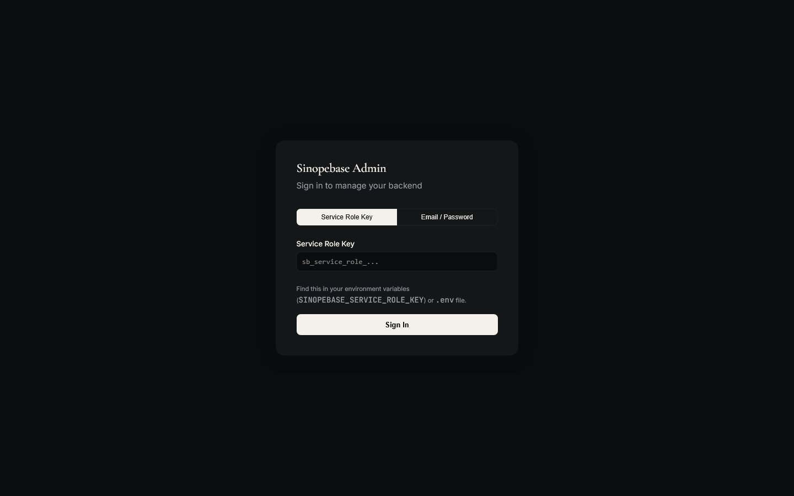 | 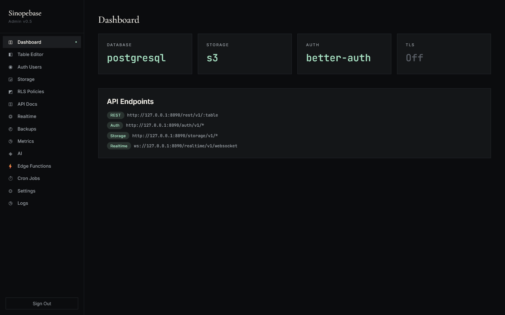 | 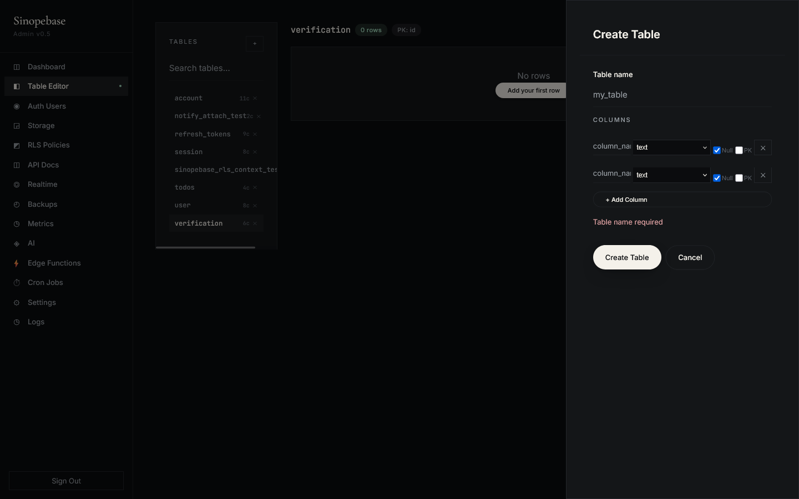 |
| 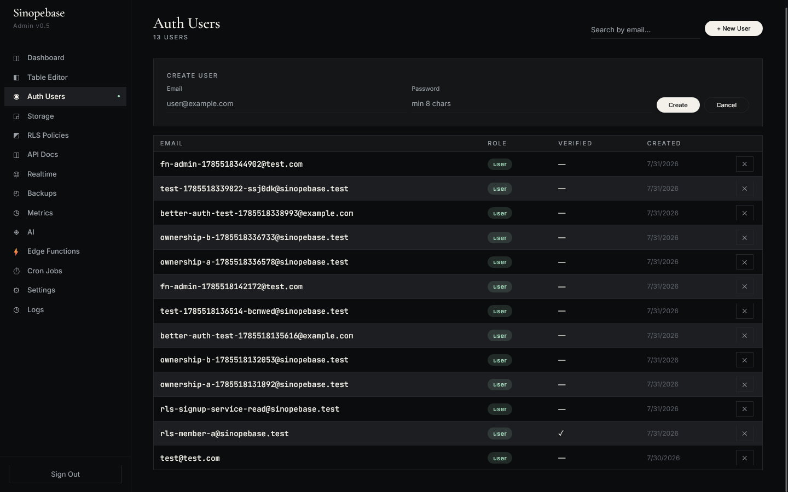 | 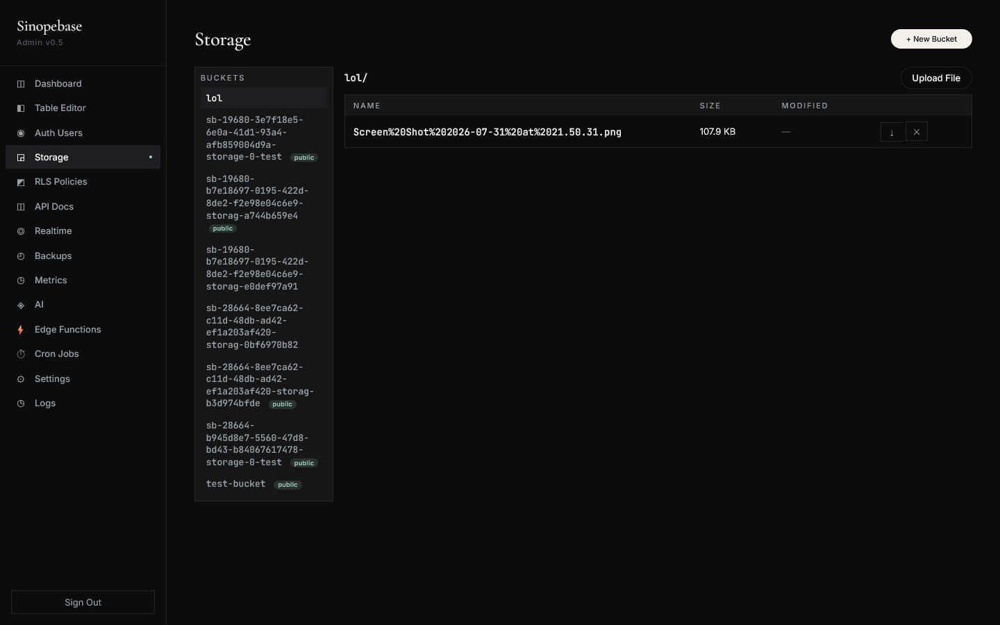 | 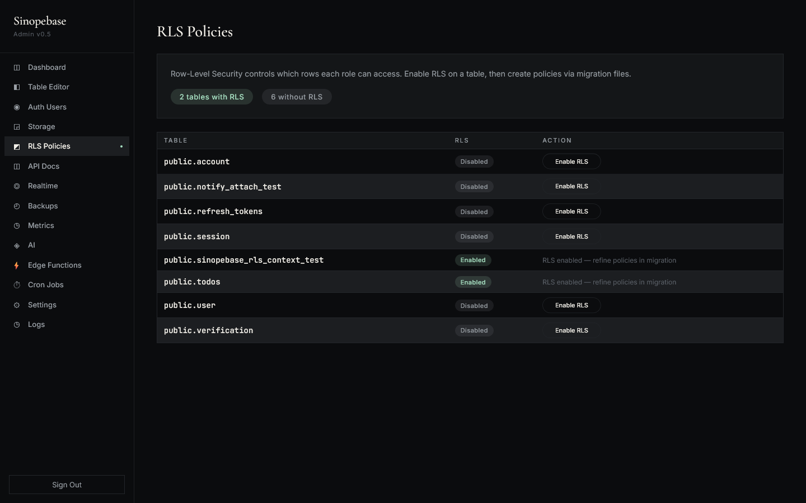 |
| 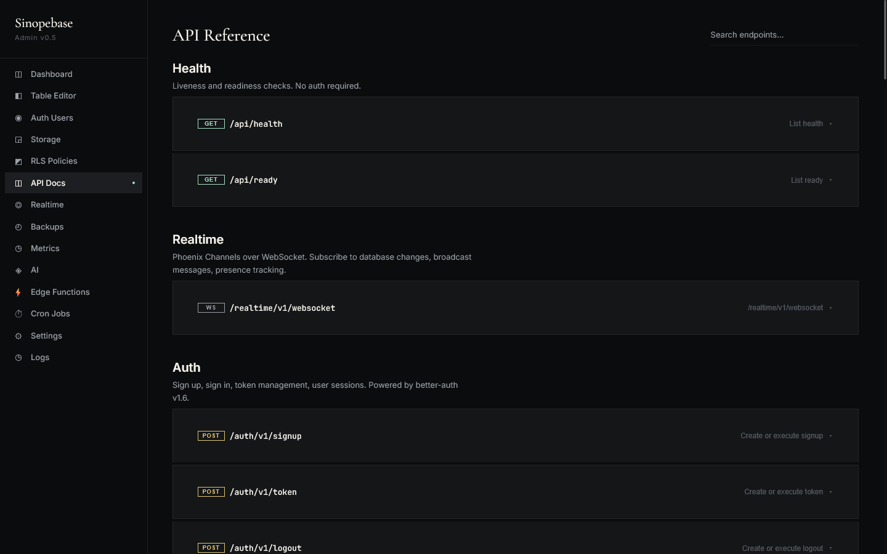 | 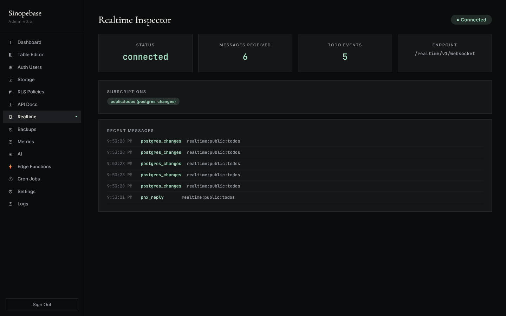 | 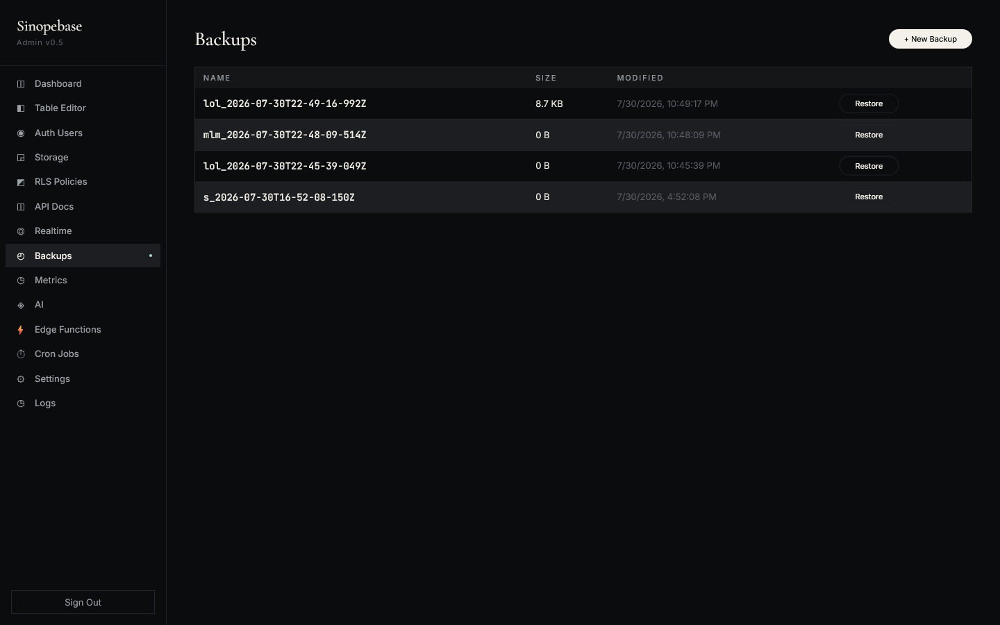 |
| 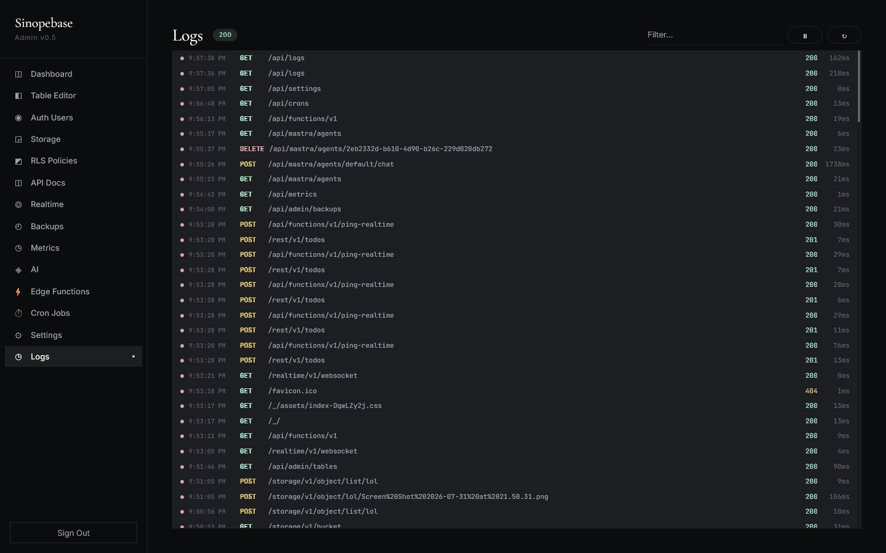 | 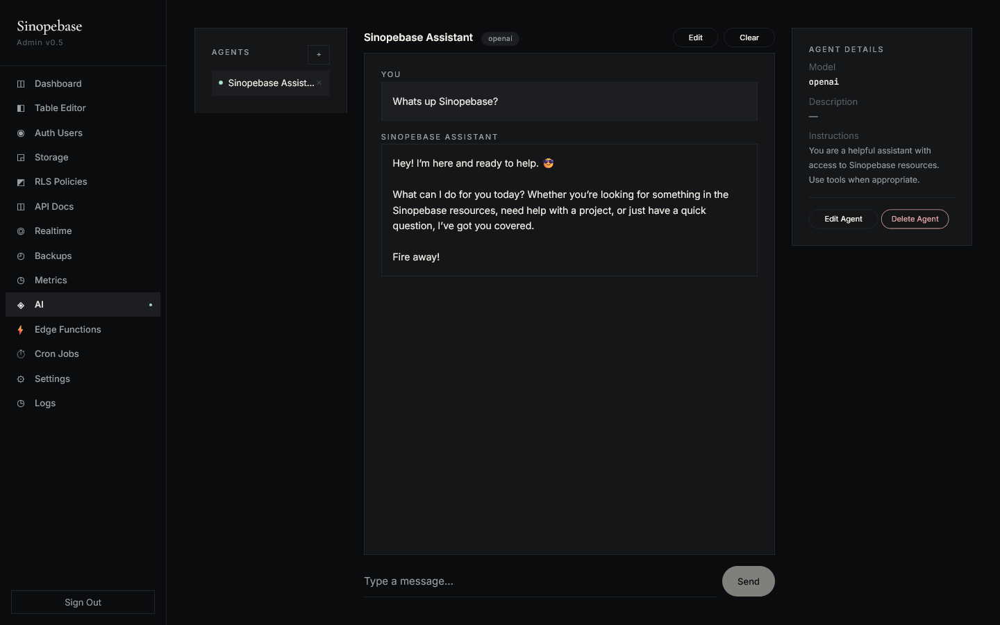 | 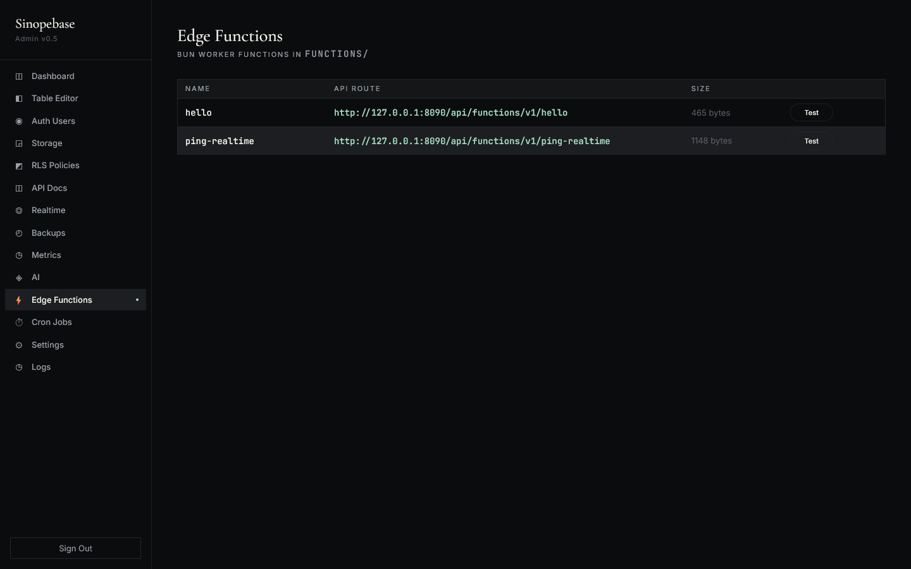 |
| 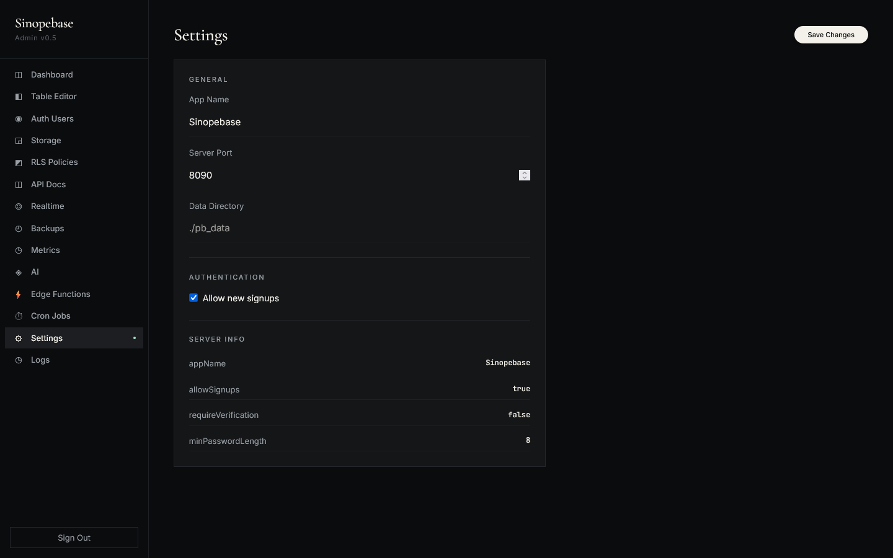 |  | |

</details>

---

## 🏗 Architecture

```
┌─────────────────────────────────────────────────────────┐
│                    Your Frontend                         │
│          import { createClient } from 'sinopebase'       │
└──────────────────────┬──────────────────────────────────┘
                       │ supabase-js compatible SDK
┌──────────────────────▼──────────────────────────────────┐
│                  Sinopebase Core                         │
│   REST API       Auth API        Realtime (Phoenix + PG) │
│   /rest/v1       /auth/v1        /realtime/v1            │
│                                                          │
│   Core: Collections · Records · Fields · Events          │
│   Hooks · Cron · Mailer · Migrations                     │
│                                                          │
│   Data: PostgreSQL (Kysely) · S3/MinIO/RustFS            │
│   better-auth · PG LISTEN/NOTIFY                         │
│                                                          │
│   Mastra AI      Edge Functions       Admin UI (Svelte)  │
│   /api/mastra/*  /api/funcs/v1        /_/               │
└──────────────────────────────────────────────────────────┘
```

Five layers, each testable in isolation: **tools → core → forms → apis → entry-points**. Plugin system for extensions.

---

## ⚡ Benchmarks

```bash
bun run compile && bun run benchmark   # needs Docker PostgreSQL + RustFS
```

| Metric | Sinopebase (compiled) | PocketBase (Go) |
|--------|------------------------|-----------------|
| **Cold start** | **562 ms** | ~5 ms |
| **Idle memory** | **117 MB** | ~40 MB |
| **Binary size** | **98 MB** | ~15 MB |
| **Health check (rps)** | **8,537** | — |
| **Health check (p50)** | **< 1 ms** | — |
| **REST select (rps)** | **7,267** | — |
| **REST select (p99)** | **37.0 ms** | — |
| **Auth signup (rps)** | **6,406** | — |
| **Auth signup (p99)** | **36.1 ms** | — |
| **Edge fn cold start (p50)** | **0.4 ms** | — |
| **Edge fn cold start (p99)** | **5.7 ms** | — |
| **Edge fn throughput** | **6,632 rps** | — |

> **Methodology:** `oha` — 50 concurrent, 10s per test against the compiled binary. Reproducible: `bun run compile && bun run benchmark`.
> **Edge functions:** Each call spawns a fresh Bun `smol` Worker — cold start every time. p50 is 0.4ms. (For context: Cloudflare Workers ~5ms, Deno Deploy ~10–50ms, AWS Lambda ~200ms+.)
> **Zero profiling. Zero optimization passes. Old Windows dev machine.**
> PocketBase numbers are best-effort from community observations.

---

## 🔒 Security

- **Timing-safe key comparison** — `crypto.timingSafeEqual`
- **HSTS** — `Strict-Transport-Security` with TLS
- **Hairline auth borders** — `service_role`, `anon`, `authenticated`
- **Rate limiting** — configurable per-endpoint
- **CORS** — whitelist origins only
- **RLS** — PostgreSQL Row-Level Security with `SET LOCAL ROLE`
- **Path-traversal protection** — admin UI file serving
- **Secret masking** — API keys hidden in admin UI
- **Pre-commit Gitleaks** — secrets never reach git history
- **Trivy container scanning** — CRITICAL+HIGH gates in CI
- **Read-only root filesystem** — Docker runs as UID 10001, all capabilities dropped

> **⚠️ Pre-1.0 caveats:** Production-mode secret enforcement, signed URL cryptography, and supply-chain attestation (SBOM, signed containers) are in progress for v1.0. PostgREST filter operators currently cover 10 operators (`eq/neq/gt/gte/lt/lte/like/ilike/is/in`); full-text search (`fts`), array operators, and `not.` negation are deferred. OAuth social + enterprise OIDC and Realtime presence are shipped (v0.6.2). See [CHANGELOG.md](CHANGELOG.md) for current status.

---

## 🧪 Development

```bash
bun install
docker compose up -d              # PostgreSQL + RustFS + Sinopebase

bun test                          # Full suite
bun run test:contract:auth        # Auth contract tests
bun run test:contract:postgrest   # PostgREST contract tests
bun run test:contract:storage     # Storage contract tests
bun run test:contract:realtime    # Realtime contract tests

bun run typecheck                 # tsc --noEmit (strict mode)
bun run lint                      # Biome + ESLint
bun run ci                        # Full CI pipeline locally

# Admin UI (with HMR — requires cd ui && bun run dev)
cd ui && bun run dev              # Svelte dev server with hot reload
```

**Test-first.** Every feature starts as a failing contract test against real PostgreSQL + RustFS in Docker. No mocks, no SQLite stand-ins.

---

## 📚 Docs

| Document | Description |
|---|---|
| [Getting Started](docs/getting-started.md) | Installation, configuration, first steps |
| [Auth & SSO](docs/auth.md) | Email, OAuth, SSO, MFA setup |
| [Edge Functions](docs/edge-functions.md) | Bun Worker functions, deployment |
| [AI & Mastra](docs/ai.md) | Agents, tools, MCP, RAG |
| [API Reference](docs/api.md) | REST, Auth, Storage, Realtime APIs |
| [Deployment](docs/deployment.md) | Railway, Docker, bare metal |
| [Development](docs/development.md) | Contributing, architecture, patterns |

---

## 🤝 Contributing

Sinopebase is **open source** and built in the open. We follow **ATDD** (acceptance test-driven development):

1. Fork & clone
2. Write the test first — it must fail against real infrastructure
3. Implement until it passes
4. Run `bun run ci` — all quality gates must be green
5. Open a PR

See [CONTRIBUTING.md](CONTRIBUTING.md) for full guidelines.

---

## 📄 License

MIT © Sinopebase

---

<p align="center">
  <sub>Built with Bun, Elysia, better-auth, Kysely, and Svelte 5.</sub>
</p>
